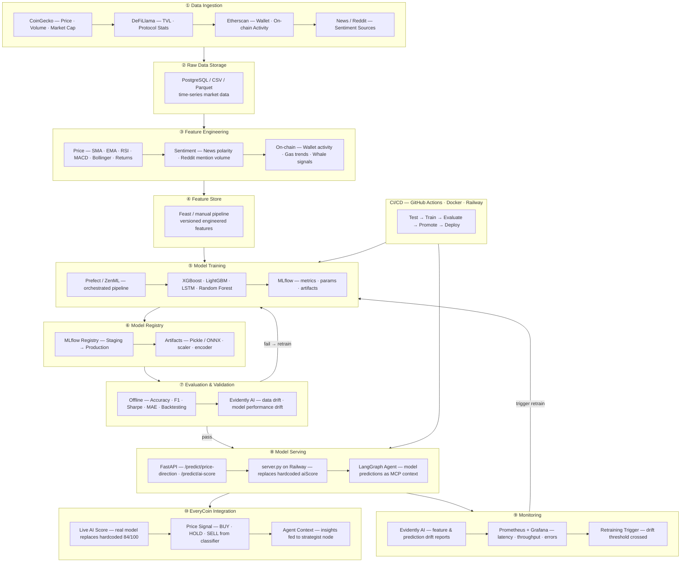

# EveryCoin — MLOps Pipeline

End-to-end MLOps pipeline for training and serving AI models that power the EveryCoin portfolio intelligence features (AI Score, price direction signals, agent context).

**Tools:** MLflow · Prefect/ZenML · Evidently AI · Prometheus/Grafana · FastAPI · Docker · GitHub Actions · Railway

